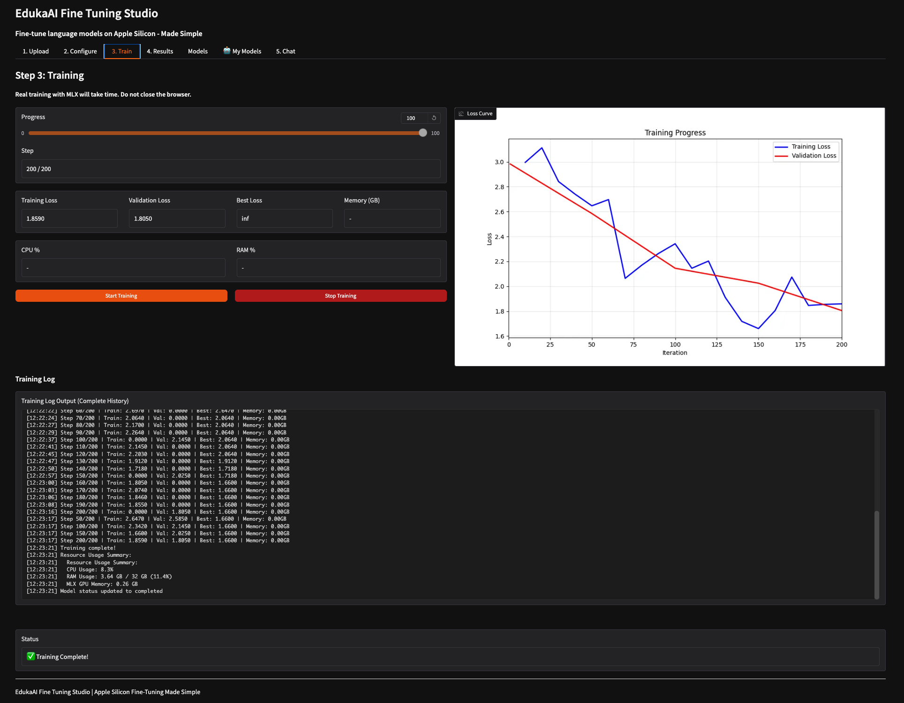

# 🤖 EdukaAI Studio

> **Fine-tune Large Language Models on Apple Silicon — Made Simple**

[](https://www.python.org/)
[](LICENSE)
[](https://www.apple.com/mac/)
[](https://ml-explore.github.io/mlx/)

**EdukaAI Studio** is a web application for fine-tuning Large Language Models (LLMs) using LoRA on Apple Silicon Macs. Built with Apple's MLX framework and Gradio, it runs in your browser and provides an intuitive interface for the complete fine-tuning workflow — from data upload to model export and testing.

<p align="center">
  
  <br>
  <em>Real-time training monitoring with interactive loss curves</em>
</p>

## ✨ Features

### 🚀 Complete Fine-Tuning Workflow
- **📤 Upload**: Support for Alpaca, ShareGPT, and custom JSONL formats
- **⚙️ Configure**: Visual parameter tuning with smart presets
- **🎯 Train**: Real-time monitoring with interactive loss curves  
- **📦 Results**: Export trained models in multiple formats:
  - **Adapters** (LoRA safetensors)
  - **Fused Models** (Full merged weights)
  - **GGUF** (For Ollama, llama.cpp, and other inference engines)
- **💬 Test**: Built-in chat interface for immediate evaluation

### 📊 Real-Time Training Dashboard
- Live loss curves with training/validation split
- GPU/CPU/Memory utilization tracking
- Training speed metrics (tokens/second)
- Best checkpoint detection
- Gradient norm monitoring

### 🍎 Apple Silicon Optimized
- **2-5x faster** than PyTorch on M-series chips
- Native MLX framework integration
- Metal Performance Shaders acceleration
- Memory-efficient gradient checkpointing
- Unified memory optimization

### 🛡️ Safe & Secure
- ✅ **100% Local** — No data leaves your machine
- ✅ **No Cloud Costs** — Train for free on your Mac
- ✅ **Privacy First** — No telemetry or tracking
- ✅ **Secure** — Input validation and resource limits

---

## 🚀 Quick Start

### Prerequisites

- macOS 12.0+ (Monterey or later)
- Apple Silicon Mac (M1/M2/M3/M4)
- Python 3.9+
- 8GB+ unified memory (16GB recommended)

### One-Line Install (Recommended)

The easiest way to get started:

```bash
curl -fsSL https://raw.githubusercontent.com/elgap/edukaai-studio/main/install.sh | bash
```

Then launch:
```bash
cd ~/EdukaAI-Fine-Tuning-Studio
./launch.sh
```

**That's it!** The installer will:
- ✅ Check system requirements
- ✅ Clone the repository
- ✅ Set up Python virtual environment
- ✅ Install all dependencies
- ✅ Create a convenient launcher

The app will open in your browser at `http://localhost:7860`

### Manual Installation

If you prefer to install manually:

```bash
# Clone the repository
git clone https://github.com/elgap/edukaai-studio.git
cd edukaai-studio

# Create virtual environment
python3 -m venv .venv
source .venv/bin/activate

# Install dependencies
pip install -r requirements.txt

# Launch the application
python src/edukaai_studio/main_simplified.py
```

The app will open in your browser at `http://localhost:7860`

---

## 📚 Documentation

### 🎓 Tutorial: Fine-Tune Your First Model

**Step 1: Upload Training Data**
1. Go to the **Upload** tab
2. Upload your dataset (JSONL format) or use our sample data
3. Supported formats: Alpaca, ShareGPT, or custom text

**Step 2: Configure Training**
1. Select a base model (Qwen, Llama, Phi, etc.)
2. Choose a preset: Quick (100 steps), Balanced (500 steps), or Maximum (1000 steps)
3. Adjust LoRA rank and learning rate if needed
4. Click "Save Configuration"

**Step 3: Train**
1. Switch to the **Train** tab
2. Click "Start Training"
3. Watch real-time progress with loss curves
4. Training completes automatically when finished

**Step 4: Export & Test**
1. Go to **Results** tab to download your model
2. Test immediately in the **Chat** tab
3. Export to GGUF for use with Ollama

---

## 💻 Supported Models

### By Size
- **Small (0.5-1B)**: Qwen3.5-0.5B, Phi-3-mini — Fast experimentation
- **Medium (2-4B)**: Qwen3.5-4B, Llama-3.2-3B — Balanced performance
- **Large (7B+)**: Qwen2.5-7B, Llama-3-8B — High quality results

### Quantization Support
- ✅ 4-bit QLoRA (70% less VRAM)
- ✅ 8-bit quantization
- ✅ 16-bit full precision

---

## 🧪 Testing

```bash
# Run all tests
pytest tests/ -v

# Run with coverage
pytest --cov=src --cov-report=html
```

**Current Coverage**: 85% (171 tests)

---

## 🤝 Contributing

We welcome contributions! See [CONTRIBUTING.md](CONTRIBUTING.md) for details.

### Quick Start for Contributors

```bash
# Fork and clone
git clone https://github.com/elgap/edukaai-studio.git
cd edukaai-studio

# Install dev dependencies
pip install -r requirements-dev.txt

# Make changes and test
pytest tests/

# Submit PR
git push origin feature/my-feature
```

---

## 🗺️ Roadmap

### ✅ Phase 1: Core (Complete)
- ✅ Real MLX training
- ✅ Training monitoring
- ✅ Model registry
- ✅ Chat interface

### 🔄 Phase 2: Enhanced (In Progress)

> ⚠️ **Note**: This project follows the [#rapidMvpMindset](https://elgap.rs/rapid-mvp-mindset) - we're in active rapid development. Features are being added and improved daily. Stay updated by watching this repository.

---

## 📞 Support

- 🐛 **Issues**: [GitHub Issues](https://github.com/elgap/edukaai-studio/issues)
- 📖 **Docs**: [eduka.elgap.ai](https://eduka.elgap.ai)

---

## 🙏 Acknowledgments

- **MLX Team** (Apple) - For the amazing ML framework
- **HuggingFace** - For model hosting and transformers library
- **Gradio Team** - For the excellent UI framework

---

## 📄 License

MIT License - see [LICENSE](LICENSE) file for details.
